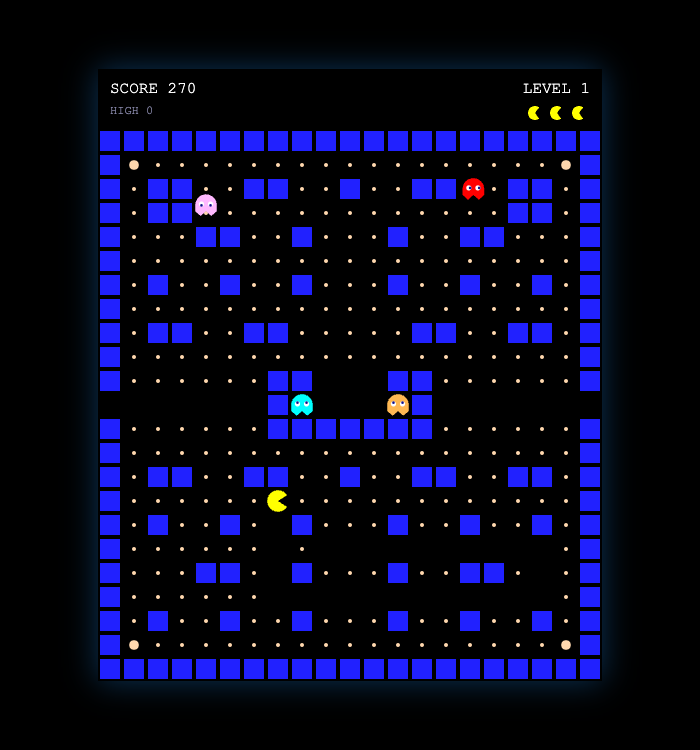

# PAC-MAN

Vanilla JavaScript + HTML5 Canvas로 만든 클래식 PAC-MAN 클론. 외부 라이브러리·프레임워크·빌드 스텝 없이 순수 정적 사이트로 동작합니다.

**🔗 Play: https://pac-man-theta-taupe.vercel.app**



## Features

- **자체 디자인 미로** — 21×23 좌우 대칭 그리드, 좌우 터널 warp, 중앙 고스트 하우스
- **정통 4종 Ghost AI** — Blinky(직접 추적) · Pinky(4칸 앞 매복, 오버플로우 버그 포함) · Inky(Blinky 기준 벡터 반사) · Clyde(거리 기반 추적/도주 전환)
- **Scatter ↔ Chase ↔ Frightened ↔ Eaten** state machine, 모드 전환 시 강제 방향 반전
- Fixed-timestep(60Hz) + accumulator 기반 game loop
- 방향키 / WASD 동시 지원 + 교차로 방향 버퍼링
- 목숨 3, 콤보 점수(200→400→800→1600), 레벨 진행

## Controls

| Key | Action |
|---|---|
| Arrow keys / WASD | 이동 |
| Enter / Space | 시작 · 재시작 |
| P / Esc | 일시정지 |

## 로컬 실행

빌드 과정이 없습니다. 정적 파일 서버 하나면 충분합니다.

```bash
python3 -m http.server 8000
# http://localhost:8000 접속
```

## Tech

Vanilla JS(ES modules) + Canvas 2D API만 사용. 외부 의존성 0, 이미지/오디오 에셋 없이 전부 코드로 드로잉. `npm install` 자체가 필요 없는 완전 정적 사이트라 어떤 정적 호스팅에도 그대로 배포됩니다.

```
index.html
src/
  constants.js               모든 튜닝 수치(속도·타이밍·점수) 한 곳에 집중
  maze.js / maze-data.js     미로 파싱 + 좌우 대칭 char-map 데이터
  input.js                   키보드 입력
  entities/
    pacman.js                이동, 방향 버퍼링, 애니메이션
    ghost.js                 state machine, 이동 결정
    ghost-targeting.js       4종 targeting 알고리즘
  game.js                    점수·목숨·레벨, 충돌 판정, 승패
  renderer.js                Canvas 드로잉
  main.js                    fixed-timestep game loop
```

## 배포

Vercel에 정적 프로젝트로 배포되어 있습니다(빌드 커맨드 불필요).

```bash
vercel --prod
```

## 설계 문서

이 프로젝트는 인터뷰 → 계획 → 구현 → 검증 순서로 진행됐습니다. 각 단계의 결정 사항과 근거는 아래 문서에 기록되어 있습니다.

- [SPEC.md](./SPEC.md) — 요구사항과 확정된 결정 사항, `[확인필요]` 표기된 미확정 수치
- [PLAN.md](./PLAN.md) — 아키텍처, ghost state machine, 자료구조, 검증 체크리스트
- [CLAUDE.md](./CLAUDE.md) — 로컬 실행/배포 명령, code style

## Note

개인 학습 목적의 팬 프로젝트입니다. PAC-MAN은 Bandai Namco Entertainment Inc.의 상표이며, 이 저장소는 이와 무관한 비상업적 클론입니다.
